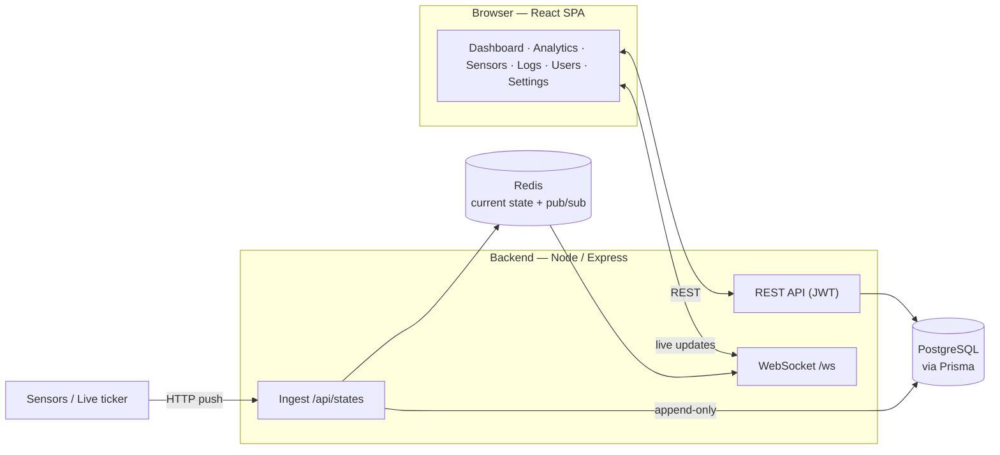

# Campus Active Sensor Monitoring System (ARDS)

Campus room-activity monitoring platform. Sensor state changes are pushed over HTTP, fanned out
in real time over WebSockets, persisted to PostgreSQL, and visualised through a React app: a
map-based monitoring dashboard, an analytics hub, a sensor registry, and a live event log —
all organised around a `SITE → BUILDING → FLOOR → ROOM` hierarchy.

## Features

- **Map dashboard** — upload floor/site maps, place building/room icons, and watch room status
  update **live** (WebSocket) as sensors report.
- **Area hierarchy** — 4-level tree (site → building → floor → room) with codes, images, and
  drag-to-position map coordinates.
- **Sensors & ingestion** — MOTION/LIGHT sensors with stable dotted keys; an open HTTP push
  endpoint feeds Redis (current state) + an append-only event log.
- **Analytics hub** — wasted-lighting (+ cost/CO₂) and occupancy/utilization (+ hour×weekday
  heatmap), backed by a daily rollup cache. See [docs/analytics-hub.md](docs/analytics-hub.md).
- **Live event log** — real-time, filterable history of every state change.
- **Auth & roles** — JWT login with `VIEWER` / `MANAGER` / `ADMIN` tiers.
- **Demo tooling** — a deterministic data generator and a two-mode live **simulator** so the
  whole system is populated and "alive" without real hardware.

## Tech stack

| Layer       | Technology                                            |
|-------------|-------------------------------------------------------|
| Frontend    | React 18 + Vite + React Router v6                     |
| Charts / map| Recharts (analytics) · Konva / react-konva (map canvas) |
| Backend     | Node.js + Express 5                                   |
| Realtime    | WebSocket (`ws`) + Redis Pub/Sub                      |
| State/cache | Redis 7 (current sensor state + pub/sub)             |
| ORM / DB    | Prisma + PostgreSQL 16                                |
| Auth        | JWT (HS256, 24h)                                      |
| Runtime     | Docker Compose                                        |

---

## Architecture



**Ingestion pipeline:** `POST /api/states/:sensor_key` → update Redis current state → publish
`state_changed` → (a) broadcast to WebSocket clients and (b) async-append a `SensorEvent` row.
Analytics are derived from the `SensorEvent` log. Full detail in
[docs/analytics-hub.md](docs/analytics-hub.md).

---

## Getting started

### Prerequisites
- Docker + Docker Compose

### 1. Configure

```bash
git clone <repo>
cd ards-project
cp .env.example .env
# Edit .env — set a strong JWT_SECRET and POSTGRES_PASSWORD
```

### 2. Start everything

```bash
docker compose up --build
```

On startup the backend automatically **applies migrations and runs the data generator**
(topology + ~30 days of demo history + map images), so the app is populated out of the box.

| Service  | URL                     |
|----------|-------------------------|
| Frontend | http://localhost:5173   |
| Backend  | http://localhost:3000   |

### 3. Log in

Seeded accounts (change for anything real):

| Username  | Password     | Role    |
|-----------|--------------|---------|
| `admin`   | `admin123`   | ADMIN   |
| `manager` | `manager123` | MANAGER |
| `viewer`  | `viewer123`  | VIEWER  |

---

## Demo data & live simulation

Because there's no real hardware, two tools populate and animate the system (run inside the
backend container):

```bash
# Regenerate users + topology + ~30 days of realistic history + map images
docker compose exec backend npm run db:seed

# Build the daily analytics rollup cache from the event log
docker compose exec backend npm run rollups:rebuild

# SIMULATE activity. Two modes:
#  - sim : realistic, accelerated occupancy (for analytics trends)
docker compose exec -e MODE=sim  -e SPEED=120 -e INTENSITY_FLOOR=0.6 backend npm run live:ticker
#  - live: real-time "spam" so Logs/Dashboard tick visibly
docker compose exec -e MODE=live -e CHANGES_PER_MIN=24 backend npm run live:ticker
```

To use your own floor/site maps, drop images in `backend/prisma/seed-assets/` and re-seed — see
[that folder's README](backend/prisma/seed-assets/README.md). The simulator and analytics knobs
are documented in [docs/analytics-hub.md](docs/analytics-hub.md#configuration-reference).

---

## Environment variables

| Variable             | Description                            | Default                 |
|----------------------|----------------------------------------|-------------------------|
| `POSTGRES_USER`      | Database user                          | `ards`                  |
| `POSTGRES_PASSWORD`  | Database password                      | —                       |
| `POSTGRES_DB`        | Database name                          | `ards_db`               |
| `DATABASE_URL`       | Prisma connection string               | —                       |
| `REDIS_URL`          | Redis connection string                | `redis://redis:6379`    |
| `JWT_SECRET`         | Secret used to sign JWTs               | —                       |
| `PORT`               | Backend listen port                    | `3000`                  |
| `VITE_API_URL`       | API base URL used by the frontend      | `http://localhost:3000` |
| `TEST_DATABASE_URL`  | Connection string for the test DB      | —                       |

Analytics (cost/operating-hours) and live-ticker tuning have their own env knobs — see the
[configuration reference](docs/analytics-hub.md#configuration-reference).

---

## Data model

```
SITE
  └── BUILDING        code: B01
        └── FLOOR     code: F01
              └── ROOM code: R101
```

- **Area** — the hierarchy above. Each area has optional `code`, `description`, `is_active`,
  map placement (`map_x`/`map_y`) and a map `image_path` (sites/floors hold the map image that
  buildings/rooms are overlaid onto).
- **Sensor** — belongs to a `ROOM`; `kind` is `MOTION` or `LIGHT` (one of each per room). A
  stable dotted `sensor_key` is generated from ancestor codes + name, e.g.
  `b01.f01.r101.motion_1`.
- **SensorEvent** — append-only log of every state change (`value`, `ts`); the source of truth
  for history and analytics. Current ("latest") state lives in **Redis**, not a DB table.
- **RoomLightingRollup** — a per-room, per-day analytics cache derived from `SensorEvent`
  (rebuilt on demand; see the analytics doc).
- **User** — `username`, `role`, `email`, `full_name`, `is_active`, `preferences`,
  `last_active_at`.

State vocabulary: `on` / `off` (plus a transient `fault`); `on`/`active`/`detected` all count
as "on".

---

## API reference

Base URL = `VITE_API_URL` (default `http://localhost:3000`). Most endpoints require
`Authorization: Bearer <token>`. Role column shows the **minimum** role.

### Auth
| Method | Path           | Role | Description                |
|--------|----------------|------|----------------------------|
| POST   | `/auth/login`  | —    | Returns a JWT              |
| POST   | `/auth/logout` | —    | No-op (stateless)          |
| GET    | `/auth/me`     | any  | Current user info          |

### Areas
| Method | Path                   | Role    | Description                          |
|--------|------------------------|---------|--------------------------------------|
| GET    | `/areas/site`          | any     | Root site                            |
| GET    | `/areas`               | any     | List all areas                       |
| GET    | `/areas/:id`           | any     | Single area                          |
| GET    | `/areas/:id/children`  | any     | Direct children                      |
| GET    | `/areas/:id/tree`      | any     | Full subtree                         |
| POST   | `/areas`               | MANAGER | Create area                          |
| PUT    | `/areas/:id`           | MANAGER | Update fields                        |
| POST   | `/areas/:id/image`     | MANAGER | Upload map image (multipart)         |
| PATCH  | `/areas/:id/position`  | MANAGER | Set `map_x`/`map_y`                  |
| PATCH  | `/areas/:id/active`    | MANAGER | Enable/disable                       |
| DELETE | `/areas/:id`           | MANAGER | Delete                               |

Uploaded images are served statically at `/uploads/<image_path>`.

### Sensors
| Method | Path                  | Role    | Description                        |
|--------|-----------------------|---------|------------------------------------|
| GET    | `/sensors`            | any     | List sensors (with room)           |
| GET    | `/sensors/:id`        | any     | Single sensor                      |
| POST   | `/sensors`            | MANAGER | Create (auto-generates key)        |
| PUT    | `/sensors/:id`        | MANAGER | Update                             |
| PATCH  | `/sensors/:id/active` | MANAGER | Enable/disable                     |
| DELETE | `/sensors/:id`        | MANAGER | Delete sensor + history            |

### Ingest (state push)
| Method | Path                     | Role | Description                       |
|--------|--------------------------|------|-----------------------------------|
| POST   | `/api/states/:sensor_key`| —    | Push a state value (open endpoint)|
| GET    | `/api/states`            | any  | Current state of all sensors      |
| GET    | `/api/states/:sensor_key`| any  | Current state of one sensor       |

Push body: `{ "state": "on", "ts": 1712345678 }` — `ts` optional (Unix seconds; omit for now).

### Events & analytics
| Method | Path                          | Role | Description                                 |
|--------|-------------------------------|------|---------------------------------------------|
| GET    | `/events`                     | any  | Event log; filters `sensor_id,from,to,limit,offset` |
| GET    | `/analytics/wasted-lighting`  | any  | Per-room wasted lighting + cost/CO₂ (`?raw=true` bypasses rollup) |
| GET    | `/analytics/occupancy`        | any  | Per-room utilization % + hour×weekday heatmap |

### Users (ADMIN) & settings
| Method | Path                     | Role  | Description            |
|--------|--------------------------|-------|------------------------|
| GET    | `/users`                 | ADMIN | List/search users      |
| GET/POST/PUT/DELETE | `/users/:id?`  | ADMIN | User CRUD              |
| GET/PUT| `/settings/profile`      | any   | Own profile            |
| GET/PUT| `/settings/preferences`  | any   | Own preferences        |

### WebSocket
`GET /ws?token=<jwt>` — on connect sends a `snapshot` of all current states, then streams
`state_changed` and `sensor_deactivated` messages.

---

## Frontend pages

Authenticated pages share a persistent shell (`AppLayout`) with a collapsible left nav and a
user menu.

| Route        | Page          | Min role | Description                                              |
|--------------|---------------|----------|----------------------------------------------------------|
| `/login`     | LoginPage     | —        | Username + password login                                |
| `/dashboard` | DashboardPage | VIEWER   | Interactive map: hierarchy nav, map upload, drag-to-place icons, **live** room status |
| `/analytics` | AnalyticsPage | MANAGER  | Energy (wasted lighting + cost) and Occupancy (utilization + heatmap) tabs |
| `/sensors`   | SensorsPage   | MANAGER  | Sensor registry CRUD with live state                     |
| `/logs`      | LogsPage      | MANAGER  | Real-time, filterable event log                          |
| `/manage`    | ManagePage    | ADMIN    | User management                                          |
| `/settings`  | SettingsPage  | any      | Profile & preferences                                    |

---

## Roles

Hierarchical (`VIEWER` < `MANAGER` < `ADMIN`):

| Role      | Capabilities                                                       |
|-----------|-------------------------------------------------------------------|
| `VIEWER`  | Read-only; dashboard + own settings                               |
| `MANAGER` | + area/sensor CRUD, analytics, logs                               |
| `ADMIN`   | + user management; full access                                    |

---

## Testing

Jest + Supertest, run against a dedicated `db_test` service with a Redis mock.

```bash
docker compose exec backend npm test
```

---

## Project structure

```
ards-project/
├── backend/
│   ├── prisma/
│   │   ├── schema.prisma
│   │   ├── migrations/
│   │   ├── seed.js              # data generator (topology + history + images)
│   │   ├── rollups-rebuild.js   # analytics rollup builder
│   │   └── seed-assets/         # site/floor map images
│   ├── scripts/
│   │   └── live-ticker.js       # sim + live activity simulator
│   ├── tests/                   # unit · integration · helpers
│   └── src/
│       ├── app.js · index.js · config.js
│       ├── controllers/ services/ repositories/ routes/ middleware/
│       ├── store/               # redis client + current-state store
│       ├── ws/                  # WebSocket server
│       └── sim/                 # shared occupancy model (generator + ticker)
├── frontend/
│   └── src/
│       ├── api/                 # fetch client wrapper
│       ├── components/          # AppLayout, OccupancyHeatmap, NavIcons, ...
│       ├── context/             # AuthContext / useAuth
│       ├── hooks/               # useWebSocket
│       ├── pages/
│       └── styles/              # tokens + shared styles
├── docs/                        # analytics-hub.md, design notes, runbooks
└── docker-compose.yml
```

## Documentation

- [Analytics hub](docs/analytics-hub.md) — data generator, endpoints, rollup, metrics, live ticker (with diagrams)
- [docs/](docs/) — design notes, runbooks, and other references
