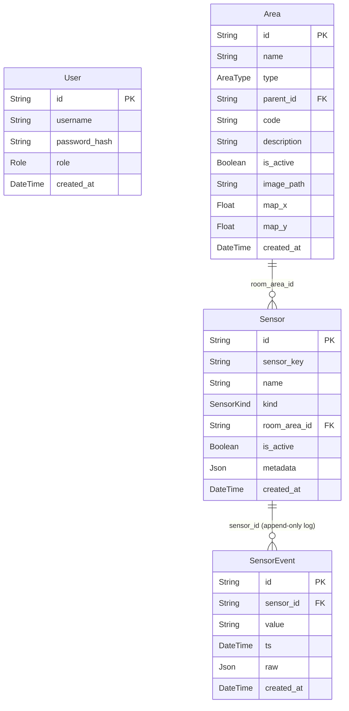

# ARDS — Design Notes

---

## Database schema



**Notes:**
- `Area.parent_id` is a self-referencing FK — the tree is an **adjacency list** (flat table, parent pointer per row). The hierarchy is fixed at 4 levels: `SITE → BUILDING → FLOOR → ROOM`, enforced by the `AreaType` enum and service-layer validation.
- `SensorState` has been removed — current sensor state is now held in Redis (see Sensor Ingestion section). See [design_legacy.md](design_legacy.md) for the old DB-backed model.
- `SensorEvent` — append-only log; one row per push event (full history).
- `User` has no relations to other tables — auth is stateless JWT.

---

## Dashboard & Area Creation

The dashboard is the primary interface for both **viewing** and **creating** the campus structure. Area creation is not a separate management page — it happens in context, directly on the map.

---

### Area hierarchy

```
SITE  (single, root)
  └── BUILDING  (icon on site map)
        └── FLOOR  (owns its own map image)
              └── ROOM  (icon on floor map)
```

| Type     | Has map image | Has placed icon | Parent   |
|----------|:---:|:---:|----------|
| SITE     | ✓ | —  | —        |
| BUILDING | — | ✓  | SITE     |
| FLOOR    | ✓ | —  | BUILDING |
| ROOM     | — | ✓  | FLOOR    |

---

### Data model additions

Added to the `Area` table:

| Field        | Type    | Used by          | Description                             |
|--------------|---------|------------------|-----------------------------------------|
| `image_path` | String? | SITE, FLOOR      | Filename under `/app/uploads/`          |
| `map_x`      | Float?  | BUILDING, ROOM   | Icon X coordinate on parent's map       |
| `map_y`      | Float?  | BUILDING, ROOM   | Icon Y coordinate on parent's map       |

---

### API additions

| Method | Endpoint                   | Auth | Description                              |
|--------|----------------------------|------|------------------------------------------|
| GET    | `/areas/site`              | ✓    | Return the single SITE or null           |
| POST   | `/areas/:id/image`         | ✓    | Upload map image (multipart/form-data)   |
| PATCH  | `/areas/:id/position`      | ✓    | Set `map_x`, `map_y` for icon placement  |

Uploaded files are stored in a Docker volume (`uploads_data`) mounted at `/app/uploads` and served as static files at `GET /uploads/:filename`.

---

### Dashboard layout

```
┌────────────────────────────────────────────────────┐
│  [Building ▾]  [Floor ▾]  [Room ▾]     [Site Name]│  ← top bar (only if site exists)
├────────────────────────────────────────────────────┤
│                                                    │
│                   MAP CANVAS                       │  ← flex: 1 (fills available height)
│         (Konva stage, aspect-ratio fit)            │
│                                                    │
├────────────────────────────────────────────────────┤
│  [Building card]  [Floor card]  [Room card]        │  ← cards row (shown when selection active)
└────────────────────────────────────────────────────┘
```

---

### Map display rules

| Selection state              | Map shown      | Icons on map    |
|------------------------------|----------------|-----------------|
| No site                      | —              | —               |
| Site only                    | Site map       | Building icons  |
| Building selected            | Site map       | Building icons  |
| Floor selected               | Floor map      | Room icons      |
| Room selected                | Floor map      | Room icons      |

The **Site button** (top-right, shows site name) always resets the view to site map.

---

### Area creation flow

#### Task 1 — Create Site

Triggered by "Create Site" button shown on an empty dashboard.

**Modal fields:** Name (required), Map image (required)

**Steps:**
1. `POST /areas` → `{ type: 'SITE', name }`
2. `POST /areas/:id/image` → uploads map file
3. Site map renders in canvas

Only one SITE can exist (enforced in backend service). `code` values must be unique among siblings (enforced in backend service — 409 on conflict, applies to create and update).

---

#### Task 2 — Create Building

Triggered by selecting `+ Create Building` from the building dropdown.

**Modal fields:** Name (required), Code (required), Description (optional)

**Steps:**
1. Modal submits → `POST /areas` → `{ type: 'BUILDING', parent_id: site.id, name, code }`
2. Modal closes; canvas enters **placement mode** (cursor: crosshair, banner shown)
3. User clicks map → `PATCH /areas/:id/position` → `{ map_x, map_y }`
4. Building icon appears on site map; building auto-selected; floor dropdown enabled

Placement cannot be skipped — the modal does not allow a "just create" without placing.

> **Placement mode** is tracked as `placingMode: null | 'click' | 'drag'`.
> - `'click'` — entered after creating a new area; canvas cursor becomes crosshair; a click places the icon.
> - `'drag'` — entered via the ↔ Move icon button; only that icon becomes draggable; dragging it and releasing saves the new position.
> - Both modes clear `placingMode` back to `null` on completion.

---

#### Task 3 — Create Floor

Triggered by selecting `+ Create Floor` from the floor dropdown (requires a building to be selected).

**Modal fields:** Code (required), Description (optional), Map image (required)

**Steps:**
1. `POST /areas` → `{ type: 'FLOOR', parent_id: building.id, name: code, code }`
2. `POST /areas/:id/image` → uploads floor map
3. Modal closes; floor auto-appears in floor dropdown

Floors have no icon — they are navigated to purely via dropdown.

---

#### Task 4 — Create Room

Triggered by selecting `+ Create Room` from the room dropdown (requires a floor to be selected).

**Modal fields:** Name (required), Code (required), Description (optional)

**Steps:**
1. Modal submits → `POST /areas` → `{ type: 'ROOM', parent_id: floor.id, name, code }`
2. Modal closes; canvas enters **placement mode** on the floor map
3. User clicks floor map → `PATCH /areas/:id/position` → `{ map_x, map_y }`
4. Room icon appears on floor map; room auto-selected

---

### Icon rendering (Konva)

Icons are fixed-size `Group` nodes (80 × 36 px) containing a `Rect` + `Text` label.

- **Building icons**: blue (`#2563eb`), rendered on site map
- **Room icons**: green (`#16a34a`), rendered on floor map
- Selected icon: slightly darker shade
- Icons are **not draggable by default**. Drag is only enabled for the specific icon that is currently in `drag` placement mode (activated via the ↔ Move icon button on its card).

Canvas is aspect-ratio-preserved:
```
scale = min(containerW / imageW, containerH / imageH, 1)
stageW = imageW × scale
stageH = imageH × scale
```

Icon stored coordinates are in **image-space** (unscaled). They are multiplied by `scale` when rendering and divided by `scale` when saving after a drag.

---

### Area detail cards (below map)

A horizontal card row appears below the map whenever any area is selected. Cards are additive — selecting a room shows all three cards simultaneously.

| Card      | Shown when                | Move icon button |
|-----------|---------------------------|:---:|
| Building  | Building selected         | ✓   |
| Floor     | Floor selected            | —   |
| Room      | Room selected             | ✓   |

Each card supports:
- **View**: name, code, description, active status
- **Edit** (inline): name and/or code (floor has code only)
- **Delete**: removes area from DB and deselects
- **Move icon** (↔): re-enters placement mode for that area's icon
- **Info** (ⓘ): shows id, type, created_at, description, linked sensors

---

### Future: room color by sensor state

Room icons will change color based on live sensor states:

| Sensor state       | Icon color      |
|--------------------|-----------------|
| Any sensor `on`    | Green `#22c55e` |
| All sensors `off`  | Dark `#374151`  |
| No sensor data     | Muted blue `#93c5fd` |
| No sensors         | Gray            |

Sensor states will be polled every 5 seconds from `GET /api/states`.

---

## Sensor Ingestion

> **Note:** The original implementation used a Node.js `Map` and `EventEmitter` for state storage and event broadcasting. These have been replaced by Redis. See [design_legacy.md](design_legacy.md) for the old architecture.

### Concept

Treat every sensor update as a small state change pushed to the backend. The backend immediately updates current state in Redis and publishes a state-changed event via Redis Pub/Sub. Everything else (UI updates, history logging) reacts to that event.

### Pipeline

```
Sensor (curl / script)
        │
        ▼
POST /api/states/:sensor_key
        │
        ▼
  Validate payload
  Resolve sensor_key → Sensor record
        │
        ▼
  Redis HSET  ◄── source of truth for dashboard reads
  Hash: sensor_states { sensor_key → { sensor_id, state, ts } }
        │
        ▼
  Redis PUBLISH: state_changed({ sensor_key, sensor_id, old_state, new_state, ts })
        │
       / \
      /   \
     ▼     ▼
  Append     WebSocket
  SensorEvent  broadcast
  (DB log)     (to clients)
```

### Infrastructure

| Component | Image / Package | Purpose |
|-----------|-----------------|---------|
| Redis | `redis:7-alpine` | State store + Pub/Sub event bus |
| ioredis | npm dependency | Node.js Redis client (two instances: publisher + subscriber) |

Redis runs with AOF persistence (`--appendonly yes`) so sensor state survives container restarts.

### Redis client (`backend/src/store/redis.client.js`)

Two ioredis instances are created from `REDIS_URL`:
- **publisher** — used for `HSET`, `HGET`, `HGETALL`, and `PUBLISH` commands
- **subscriber** — dedicated to `SUBSCRIBE` mode (Redis requires a separate connection for subscriptions)

### State store (`backend/src/store/state.store.js`)

Same API as the old in-memory store, now backed by a Redis hash:

| Function | Redis command | Description |
|----------|---------------|-------------|
| `setState(key, id, state, ts)` | `HSET sensor_states <key> <json>` | Store current sensor reading |
| `getState(key)` | `HGET sensor_states <key>` | Get single sensor state |
| `getAllStates()` | `HGETALL sensor_states` | Get all sensor states (used by `GET /api/states`) |

All functions are `async` (network I/O to Redis).

### Event broadcasting

The ingestion service publishes to the `state_changed` Redis channel after updating state. Two subscribers listen on this channel:
1. **`app.js`** — appends a `SensorEvent` row to Postgres (history log)
2. **`ws/server.js`** — broadcasts the state change to all connected WebSocket clients (real-time UI)

### Key decisions

- **Redis first** — the HTTP response returns immediately after `HSET` + `PUBLISH`. DB writes are async and do not block ingestion.
- **Survives restarts** — unlike the old in-memory `Map`, Redis persists state across server crashes and deploys.
- **Horizontally scalable** — multiple backend instances can share the same Redis for state and Pub/Sub.
- **Single DB table** — `SensorEvent` (append-only log = full history). The old `SensorState` table has been removed — Redis is the sole source of current state.
- **No auth on push endpoint** — sensors push without user tokens. Auth is only required for reading state snapshots.

### Sensor key format

Keys are system-generated from the area hierarchy:
```
{building_code}.{floor_code}.{room_code}.{sensor_name_slug}
e.g. B01.F01.R101.motion_sensor_1
```
Generated at sensor registration time by traversing the area tree. Stable for the lifetime of the sensor.

---

## WebSocket — Real-Time Sensor State

> **Note:** WebSocket replaces the previous 5-second polling of `GET /api/states`. The polling approach is documented in [design_legacy.md](design_legacy.md).

### Concept

The backend pushes sensor state changes to connected frontend clients instantly via WebSocket. On connect, the server sends a full state snapshot so the client starts with accurate data. Subsequent updates are individual `state_changed` messages.

### Server (`backend/src/ws/server.js`)

- Uses the `ws` library with `noServer: true` — handles HTTP upgrade manually
- **Auth:** JWT is passed as a query parameter (`ws://host/ws?token=<jwt>`). Verified on upgrade; connection rejected before handshake if invalid.
- **Snapshot on connect:** immediately sends all current states from Redis via `getAllStates()`
- **Broadcast:** subscribes to Redis `state_changed` channel; forwards each event to all connected clients

### Message types (server → client)

| Type | When | Payload |
|------|------|---------|
| `snapshot` | On connect | `{ type: "snapshot", states: { <sensor_key>: { sensor_id, state, ts }, ... } }` |
| `state_changed` | On each sensor push | `{ type: "state_changed", sensor_key, sensor_id, state, ts }` |

### Frontend hook (`frontend/src/hooks/useWebSocket.js`)

- `useWebSocket()` — returns `sensorStates` object (same shape as the old polling response)
- Auto-connects using token from `sessionStorage`
- Handles `snapshot` (full replace) and `state_changed` (merge single key)
- Auto-reconnects with exponential backoff (1s → 10s max)
- Used by DashboardPage and SensorsPage

### Infrastructure

| Component | Package | Purpose |
|-----------|---------|---------|
| ws | npm dependency | WebSocket server for Node.js |
| WebSocket API | browser built-in | Client connection (no extra library) |

The HTTP server is created with `http.createServer(app)` in `index.js` to support both Express routes and WebSocket upgrades on the same port.

---

## Room Icon — Live Sensor State

Room icons on the dashboard reflect live sensor state. Each room can have at most **one sensor per kind** (enforced by a `@@unique([room_area_id, kind])` constraint).

### Icon structure (Konva)

```
┌──────────────────┐
│    Room Name     │  ← room label
├──────────────────┤
│  [■] [■]         │  ← sensor badges (one per sensor, colored by kind)
└──────────────────┘
```

- Size: 80 × 48 px (taller than building icons at 80 × 36)
- Sensor badges are small rounded rects (16 × 8 px), colored by sensor kind to match the SensorsPage badge style
- Badge opacity/stroke conveys state; overall background color is derived from all sensors collectively

### Sensor badge colors (by kind)

| Kind   | Color   | Hex       |
|--------|---------|-----------|
| LIGHT  | Amber   | `#d97706` |
| MOTION | Purple  | `#7c3aed` |

### Badge state indicators

| State | Opacity | Stroke |
|-------|---------|--------|
| Active (on) | 1.0 | — |
| Idle (off) | 0.45 | — |
| Fault/error | 1.0 | Yellow `#eab308` |
| No data | 0.35 | — |

### Overall icon background color

Derived from all sensors in the room collectively:

| Condition | Color | Hex |
|-----------|-------|-----|
| Any sensor fault/error | Yellow | `#eab308` |
| Any sensor active/on | Green | `#22c55e` |
| All sensors idle/off | Blueish-gray | `#64748b` |
| No sensors assigned | Gray | `#9ca3af` |
| Sensors exist, no data | Gray | `#9ca3af` |

Selected room uses a slightly darker shade of the same color.

### Live updates (WebSocket)

- `GET /sensors` fetched on mount → populates sensor list
- Sensor states are pushed in real-time via WebSocket (no polling)
- Room icon colors and badge opacities re-render reactively on state changes

---

## Telemetry — Event Log

### Concept

Every sensor state push is already appended to the `SensorEvent` table (via the `state_changed` Redis Pub/Sub listener). The event log feature exposes this history through a query API and a filterable frontend page.

### Database indexes

Two indexes added to `SensorEvent` for query performance:

```sql
CREATE INDEX "SensorEvent_sensor_id_ts_idx" ON "SensorEvent"("sensor_id", "ts" DESC);
CREATE INDEX "SensorEvent_ts_idx" ON "SensorEvent"("ts" DESC);
```

The composite index covers sensor-filtered queries; the standalone `ts` index covers unfiltered time-ordered queries.

### API

| Method | Endpoint   | Auth | Description |
|--------|------------|------|-------------|
| GET    | `/events`  | ✓    | List events with optional filters |

**Query parameters** (all optional):

| Param       | Type   | Description |
|-------------|--------|-------------|
| `sensor_id` | UUID   | Filter to a specific sensor |
| `from`      | ISO date | Events with `ts >= from` |
| `to`        | ISO date | Events with `ts <= to` |
| `limit`     | int    | Max rows returned (default 50, max 200) |
| `offset`    | int    | Skip N rows for pagination |

**Response:** JSON array ordered by `ts` descending (newest first). Each event includes its sensor name and key via a join:

```json
[
  {
    "id": "uuid",
    "sensor_id": "uuid",
    "value": "on",
    "ts": "2026-03-09T12:34:56.000Z",
    "raw": null,
    "created_at": "...",
    "sensor": {
      "id": "uuid",
      "name": "Light 1",
      "sensor_key": "B02.F01.R101.light"
    }
  }
]
```

### Backend layers

```
event.routes.js  →  event.controller.js  →  event.service.js  →  sensor.repository.findEvents()
     GET /events       extract query params     clamp limit/offset      Prisma query with filters
     requireAuth
```

### Frontend — LogsPage

**Route:** `/logs` (protected, inside `AppLayout`)

**Layout:**

```
┌────────────────────────────────────────────────────────┐
│  [Sensor ▾]  From [____]  To [____]  [Apply] [Clear]  │  ← filter bar
├────────────────────────────────────────────────────────┤
│  Timestamp    │ Sensor      │ Key           │ Value    │
│  ─────────────┼─────────────┼───────────────┼──────────│
│  3/9 12:34    │ ● Light 1   │ B02.F01...    │ [on]     │
│  3/9 12:33    │ ● Motion 1  │ B02.F01...    │ [off]    │
│  ...          │             │               │          │
├────────────────────────────────────────────────────────┤
│                    [Load More]                         │
└────────────────────────────────────────────────────────┘
```

- **Filter bar:** sensor dropdown (populated from `GET /sensors`), date-from/to inputs, Apply/Clear buttons
- **Table:** sticky headers, sensor kind dot (purple/amber), value badges (green for on, gray for off, yellow for fault)
- **Pagination:** "Load More" button appends next page; hidden when fewer rows than limit are returned
- **Empty state:** "No events found." message
- Changing any filter resets offset to 0 and replaces the event list
