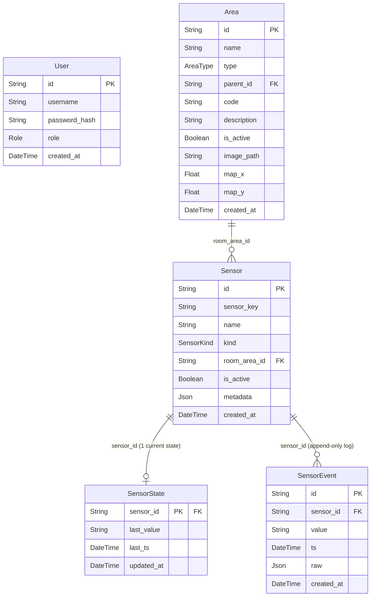

# ARDS — Design Notes

---

## Database schema



**Notes:**
- `Area.parent_id` is a self-referencing FK — the tree is an **adjacency list** (flat table, parent pointer per row). The hierarchy is fixed at 4 levels: `SITE → BUILDING → FLOOR → ROOM`, enforced by the `AreaType` enum and service-layer validation.
- `SensorState` — one mutable row per sensor (current reading, upserted on each push).
- `SensorEvent` — append-only log; one row per push event (full history).
- `User` has no relations to other tables — auth is stateless JWT.

---

## Dashboard & Area Creation

The dashboard is the primary interface for both **viewing** and **creating** the campus structure. Area creation is not a separate management page — it happens in context, directly on the map.

---

### Area hierarchy

```
SITE  (single, root)
  └── BUILDING  (icon on site map)
        └── FLOOR  (owns its own map image)
              └── ROOM  (icon on floor map)
```

| Type     | Has map image | Has placed icon | Parent   |
|----------|:---:|:---:|----------|
| SITE     | ✓ | —  | —        |
| BUILDING | — | ✓  | SITE     |
| FLOOR    | ✓ | —  | BUILDING |
| ROOM     | — | ✓  | FLOOR    |

---

### Data model additions

Added to the `Area` table:

| Field        | Type    | Used by          | Description                             |
|--------------|---------|------------------|-----------------------------------------|
| `image_path` | String? | SITE, FLOOR      | Filename under `/app/uploads/`          |
| `map_x`      | Float?  | BUILDING, ROOM   | Icon X coordinate on parent's map       |
| `map_y`      | Float?  | BUILDING, ROOM   | Icon Y coordinate on parent's map       |

---

### API additions

| Method | Endpoint                   | Auth | Description                              |
|--------|----------------------------|------|------------------------------------------|
| GET    | `/areas/site`              | ✓    | Return the single SITE or null           |
| POST   | `/areas/:id/image`         | ✓    | Upload map image (multipart/form-data)   |
| PATCH  | `/areas/:id/position`      | ✓    | Set `map_x`, `map_y` for icon placement  |

Uploaded files are stored in a Docker volume (`uploads_data`) mounted at `/app/uploads` and served as static files at `GET /uploads/:filename`.

---

### Dashboard layout

```
┌────────────────────────────────────────────────────┐
│  [Building ▾]  [Floor ▾]  [Room ▾]     [Site Name]│  ← top bar (only if site exists)
├────────────────────────────────────────────────────┤
│                                                    │
│                   MAP CANVAS                       │  ← flex: 1 (fills available height)
│         (Konva stage, aspect-ratio fit)            │
│                                                    │
├────────────────────────────────────────────────────┤
│  [Building card]  [Floor card]  [Room card]        │  ← cards row (shown when selection active)
└────────────────────────────────────────────────────┘
```

---

### Map display rules

| Selection state              | Map shown      | Icons on map    |
|------------------------------|----------------|-----------------|
| No site                      | —              | —               |
| Site only                    | Site map       | Building icons  |
| Building selected            | Site map       | Building icons  |
| Floor selected               | Floor map      | Room icons      |
| Room selected                | Floor map      | Room icons      |

The **Site button** (top-right, shows site name) always resets the view to site map.

---

### Area creation flow

#### Task 1 — Create Site

Triggered by "Create Site" button shown on an empty dashboard.

**Modal fields:** Name (required), Map image (required)

**Steps:**
1. `POST /areas` → `{ type: 'SITE', name }`
2. `POST /areas/:id/image` → uploads map file
3. Site map renders in canvas

Only one SITE can exist (enforced in backend service). `code` values must be unique among siblings (enforced in backend service — 409 on conflict, applies to create and update).

---

#### Task 2 — Create Building

Triggered by selecting `+ Create Building` from the building dropdown.

**Modal fields:** Name (required), Code (required), Description (optional)

**Steps:**
1. Modal submits → `POST /areas` → `{ type: 'BUILDING', parent_id: site.id, name, code }`
2. Modal closes; canvas enters **placement mode** (cursor: crosshair, banner shown)
3. User clicks map → `PATCH /areas/:id/position` → `{ map_x, map_y }`
4. Building icon appears on site map; building auto-selected; floor dropdown enabled

Placement cannot be skipped — the modal does not allow a "just create" without placing.

> **Placement mode** is tracked as `placingMode: null | 'click' | 'drag'`.
> - `'click'` — entered after creating a new area; canvas cursor becomes crosshair; a click places the icon.
> - `'drag'` — entered via the ↔ Move icon button; only that icon becomes draggable; dragging it and releasing saves the new position.
> - Both modes clear `placingMode` back to `null` on completion.

---

#### Task 3 — Create Floor

Triggered by selecting `+ Create Floor` from the floor dropdown (requires a building to be selected).

**Modal fields:** Code (required), Description (optional), Map image (required)

**Steps:**
1. `POST /areas` → `{ type: 'FLOOR', parent_id: building.id, name: code, code }`
2. `POST /areas/:id/image` → uploads floor map
3. Modal closes; floor auto-appears in floor dropdown

Floors have no icon — they are navigated to purely via dropdown.

---

#### Task 4 — Create Room

Triggered by selecting `+ Create Room` from the room dropdown (requires a floor to be selected).

**Modal fields:** Name (required), Code (required), Description (optional)

**Steps:**
1. Modal submits → `POST /areas` → `{ type: 'ROOM', parent_id: floor.id, name, code }`
2. Modal closes; canvas enters **placement mode** on the floor map
3. User clicks floor map → `PATCH /areas/:id/position` → `{ map_x, map_y }`
4. Room icon appears on floor map; room auto-selected

---

### Icon rendering (Konva)

Icons are fixed-size `Group` nodes (80 × 36 px) containing a `Rect` + `Text` label.

- **Building icons**: blue (`#2563eb`), rendered on site map
- **Room icons**: green (`#16a34a`), rendered on floor map
- Selected icon: slightly darker shade
- Icons are **not draggable by default**. Drag is only enabled for the specific icon that is currently in `drag` placement mode (activated via the ↔ Move icon button on its card).

Canvas is aspect-ratio-preserved:
```
scale = min(containerW / imageW, containerH / imageH, 1)
stageW = imageW × scale
stageH = imageH × scale
```

Icon stored coordinates are in **image-space** (unscaled). They are multiplied by `scale` when rendering and divided by `scale` when saving after a drag.

---

### Area detail cards (below map)

A horizontal card row appears below the map whenever any area is selected. Cards are additive — selecting a room shows all three cards simultaneously.

| Card      | Shown when                | Move icon button |
|-----------|---------------------------|:---:|
| Building  | Building selected         | ✓   |
| Floor     | Floor selected            | —   |
| Room      | Room selected             | ✓   |

Each card supports:
- **View**: name, code, description, active status
- **Edit** (inline): name and/or code (floor has code only)
- **Delete**: removes area from DB and deselects
- **Move icon** (↔): re-enters placement mode for that area's icon
- **Info** (ⓘ): shows id, type, created_at, description, linked sensors

---

### Future: room color by sensor state

Room icons will change color based on live sensor states:

| Sensor state       | Icon color      |
|--------------------|-----------------|
| Any sensor `on`    | Green `#22c55e` |
| All sensors `off`  | Dark `#374151`  |
| No sensor data     | Muted blue `#93c5fd` |
| No sensors         | Gray            |

Sensor states will be polled every 5 seconds from `GET /api/states`.

---

## Sensor Ingestion

### Concept

Treat every sensor update as a small state change pushed to the backend. The backend immediately updates the current state in memory and publishes a state-changed event. Everything else (UI updates, history logging) reacts to that event.

### Pipeline

```
Sensor (curl / script)
        │
        ▼
POST /api/states/:sensor_key
        │
        ▼
  Validate payload
  Resolve sensor_key → Sensor record
        │
        ▼
  In-memory store  ◄── source of truth for dashboard reads
  Map<sensor_key, { sensor_id, state, ts }>
        │
        ▼
  Emit: state_changed({ sensor_key, sensor_id, old_state, new_state, ts })
        │
       / \
      /   \
     ▼     ▼
Upsert   Append
Sensor   Sensor
State    Event
(DB)     (DB)
current  history
```

### Key decisions

- **In-memory first** — the HTTP response returns immediately after updating the store. DB writes are async and do not block ingestion.
- **Two DB tables** — `SensorState` (one row per sensor, mutable upsert = current status) and `SensorEvent` (append-only log = full history).
- **Event emitter** — decouples ingestion from consumers. Adding a new consumer (e.g. WebSocket broadcast) means adding one listener, touching no ingestion code.
- **No auth on push endpoint** — sensors push without user tokens. Auth is only required for reading state snapshots.

### Sensor key format

Keys are system-generated from the area hierarchy:
```
{building_code}.{floor_code}.{room_code}.{sensor_name_slug}
e.g. B01.F01.R101.motion_sensor_1
```
Generated at sensor registration time by traversing the area tree. Stable for the lifetime of the sensor.
