# HallSense — Project Learning Doc

> Campus Active Room/Door Sensor monitoring system (ARDS). Sensors push readings over
> HTTP → backend updates an in-memory (Redis) state store → state changes fan out to a
> live React dashboard over WebSockets, and are persisted to PostgreSQL as an append-only
> event log.

This document is the single reference for understanding the system: the runtime topology,
every API endpoint, the database schema and relationships, the code structure, and the
key sequence/workflow diagrams. Diagrams are written in [Mermaid](https://mermaid.js.org/)
and render natively on GitHub and most Markdown viewers.

> **Note on accuracy:** this doc was reverse-engineered from the source (not the README,
> which is partially stale — e.g. it still mentions HTTP polling and a `HomePage`/`AreasPage`
> that no longer exist). Where the code and README disagree, the code wins here.

---

## 1. Tech stack & runtime

| Layer       | Technology                                            |
|-------------|-------------------------------------------------------|
| Frontend    | React 18 + Vite + React Router v6 + react-konva (canvas map) |
| Backend     | Node.js + Express                                     |
| Realtime    | WebSocket (`ws`) + Redis Pub/Sub                      |
| State store | Redis hash (`sensor_states`)                          |
| ORM         | Prisma                                                |
| Database    | PostgreSQL 16                                         |
| Auth        | JWT (HS256), bcrypt password hashing                  |
| Runtime     | Docker Compose (not run on host)                      |

### Docker Compose services

| Service    | Image / build         | Purpose                                   | Port  |
|------------|-----------------------|-------------------------------------------|-------|
| `db`       | postgres:16-alpine    | Primary database                          | —     |
| `db_test`  | postgres:16-alpine    | Isolated test database (`ards_test`)      | 5434  |
| `redis`    | redis:7-alpine (AOF)  | State store + Pub/Sub bus                 | —     |
| `backend`  | `./backend`           | Express API + WebSocket server            | 3000  |
| `frontend` | `./frontend`          | Vite dev server / React SPA               | 5173  |

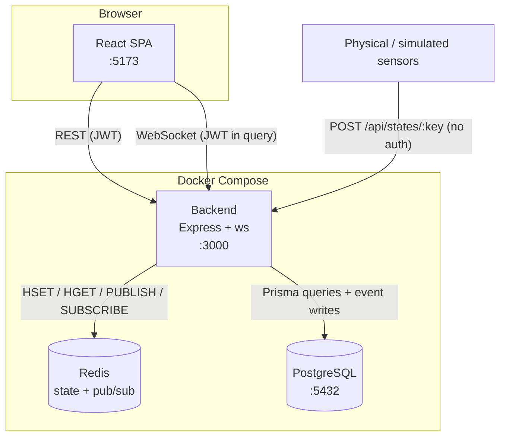

---

## 2. System architecture (backend layers)

The backend is a **layered functional architecture** (not class-based OOP — see §6). Each
HTTP request flows through the same pipeline:

```
Route → Middleware (auth/role) → Controller → Service → Repository → Prisma → PostgreSQL
                                                  │
                                                  └→ Redis (state store + pub/sub)
```

| Layer          | Responsibility                                              | Example file |
|----------------|------------------------------------------------------------|--------------|
| **Routes**     | URL → handler mapping, attach middleware                   | `routes/area.routes.js` |
| **Middleware** | JWT verification (`requireAuth`), RBAC (`requireRole`)     | `middleware/*.js` |
| **Controllers**| HTTP concerns: parse req, shape response, map errors→status| `controllers/area.controller.js` |
| **Services**   | Business rules & validation (hierarchy, key generation, uniqueness) | `services/area.service.js` |
| **Repositories**| Data access via Prisma; no business logic                 | `repositories/area.repository.js` |
| **Store**      | Redis-backed current-state hash + pub/sub clients          | `store/state.store.js`, `store/redis.client.js` |
| **WS**         | WebSocket server, auth-on-upgrade, broadcast loop          | `ws/server.js` |

Error convention: services throw `Error` objects augmented with a `.status` property
(`Object.assign(new Error(msg), { status: 409 })`); controllers read `err.status || 500`.

---

## 3. API reference

All responses are JSON. Auth is `Authorization: Bearer <jwt>` unless noted. RBAC uses a role
hierarchy `VIEWER(0) < MANAGER(1) < ADMIN(2)`; "Min role" is the lowest role accepted.

> **Mount-point quirk:** most routers are mounted at the **root** (`/auth`, `/areas`,
> `/sensors`, `/events`, `/users`, `/settings`) — only ingestion is under `/api`
> (`/api/states`). There is no global `/api` prefix despite what the README implies.

### 3.1 Auth — `/auth`

| Method | Path           | Min role | Description                          |
|--------|----------------|----------|--------------------------------------|
| POST   | `/auth/login`  | public   | `{username, password}` → `{token}`   |
| POST   | `/auth/logout` | public   | No-op (JWT is stateless)             |
| GET    | `/auth/me`     | any auth | Current user `{id, username, role, email, full_name}` |

### 3.2 Areas — `/areas`  (all require auth; writes require MANAGER)

| Method | Path                  | Min role | Description                                |
|--------|-----------------------|----------|--------------------------------------------|
| GET    | `/areas/site`         | VIEWER   | The singleton SITE area (or `null`)        |
| GET    | `/areas`              | VIEWER   | Root areas (`parent_id = null`)            |
| GET    | `/areas/:id`          | VIEWER   | Single area (404 if missing)               |
| GET    | `/areas/:id/children` | VIEWER   | Direct children                            |
| GET    | `/areas/:id/tree`     | VIEWER   | Area + full subtree (eager 3 levels deep)  |
| POST   | `/areas`              | MANAGER  | Create area (validates hierarchy)          |
| PUT    | `/areas/:id`          | MANAGER  | Update `name` / `code` / `description`     |
| POST   | `/areas/:id/image`    | MANAGER  | Upload map image (multipart, field `image`, ≤20 MB) |
| PATCH  | `/areas/:id/position` | MANAGER  | Set `{map_x, map_y}` icon position         |
| PATCH  | `/areas/:id/active`   | MANAGER  | Enable/disable (`{is_active: bool}`)       |
| DELETE | `/areas/:id`          | MANAGER  | Delete (409 if it has children)            |

### 3.3 Sensors — `/sensors`  (all require auth; writes require MANAGER)

| Method | Path                  | Min role | Description                                |
|--------|-----------------------|----------|--------------------------------------------|
| GET    | `/sensors`            | VIEWER   | All sensors (+ linked room)                |
| GET    | `/sensors/:id`        | VIEWER   | Single sensor                              |
| POST   | `/sensors`            | MANAGER  | Create; auto-generates `sensor_key`        |
| PUT    | `/sensors/:id`        | MANAGER  | Update name/kind/room/metadata             |
| PATCH  | `/sensors/:id/active` | MANAGER  | Enable/disable; deactivation clears Redis state + broadcasts `sensor_deactivated` |
| DELETE | `/sensors/:id`        | MANAGER  | Delete sensor (+ its events)               |

### 3.4 Ingest / state — `/api/states`

| Method | Path                     | Min role | Description                              |
|--------|--------------------------|----------|------------------------------------------|
| POST   | `/api/states/:sensor_key`| **public** | Push a reading: `{state, ts?}` (`ts` = Unix seconds) |
| GET    | `/api/states`            | any auth | Current state of all sensors (map)       |
| GET    | `/api/states/:sensor_key`| any auth | Current state of one sensor (404 if none)|

Push body: `{ "state": "on", "ts": 1712345678 }`. `ts` optional; omitted → server time.
Push returns 404 for unknown key, 403 if the sensor is inactive.

### 3.5 Events (history) — `/events`  (require auth)

| Method | Path      | Min role | Description                                        |
|--------|-----------|----------|----------------------------------------------------|
| GET    | `/events` | any auth | Query event log. Params: `sensor_id`, `from`, `to`, `limit` (1–200, default 50), `offset`. Sorted `ts desc`. |

### 3.6 Users (admin only) — `/users`  (require ADMIN)

| Method | Path         | Min role | Description                                  |
|--------|--------------|----------|----------------------------------------------|
| GET    | `/users`     | ADMIN    | List `{users, total}`. Params: `search`, `role`, `is_active`, `limit`, `offset` |
| GET    | `/users/:id` | ADMIN    | Single user                                  |
| POST   | `/users`     | ADMIN    | Create `{username, password, role?, email?, full_name?}` |
| PUT    | `/users/:id` | ADMIN    | Update email/full_name/role/is_active        |
| DELETE | `/users/:id` | ADMIN    | Delete (400 if deleting your own account)    |

### 3.7 Settings (self-service) — `/settings`  (require auth)

| Method | Path                   | Min role | Description                         |
|--------|------------------------|----------|-------------------------------------|
| GET    | `/settings/profile`    | any auth | Own profile                         |
| PUT    | `/settings/profile`    | any auth | Update own `full_name` / `email`    |
| GET    | `/settings/preferences`| any auth | Own preferences JSON                |
| PUT    | `/settings/preferences`| any auth | Replace preferences JSON            |

### 3.8 Health & static

| Method | Path           | Description                              |
|--------|----------------|------------------------------------------|
| GET    | `/health`      | `{status: "ok"}`                         |
| GET    | `/uploads/*`   | Static map images (served from `/app/uploads`) |

### 3.9 WebSocket — `ws://<host>/ws?token=<jwt>`

Auth happens on the HTTP **upgrade** (JWT in query string; rejected with 401 before the
handshake). Server → client message types:

| Type                  | Payload                                             | When                       |
|-----------------------|----------------------------------------------------|----------------------------|
| `snapshot`            | `{states: {sensor_key: {sensor_id, state, ts}}}`   | On connect (full state)    |
| `state_changed`       | `{sensor_key, sensor_id, state, ts}`               | On any ingested reading    |
| `sensor_deactivated`  | `{sensor_key, sensor_id}`                          | When a sensor is disabled  |

---

## 4. Database schema & relationships

PostgreSQL via Prisma. UUID primary keys, snake_case columns.

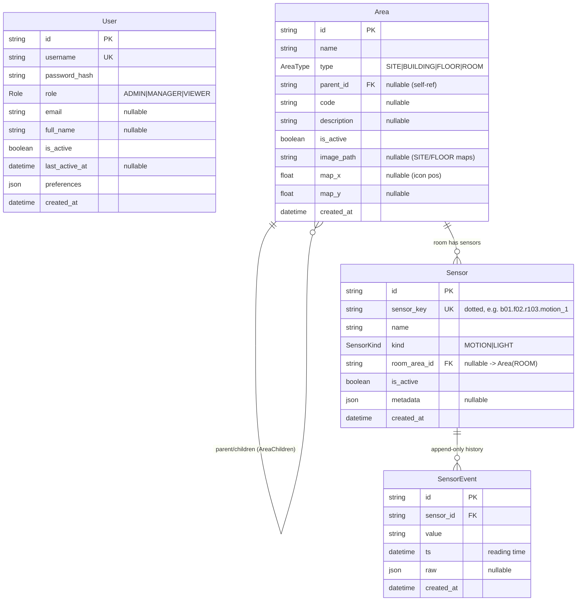

### Key constraints & design notes

- **Area is a self-referential tree.** `parent_id` → `Area.id` via the named relation
  `AreaChildren`. The hierarchy is a **fixed 4 levels**: `SITE → BUILDING → FLOOR → ROOM`,
  enforced in the service layer (`VALID_PARENT_TYPE`), so subtree reads use a static
  3-deep `include` instead of a recursive query.
- **SITE is a singleton** — `createArea` rejects a second SITE (409).
- `Sensor.@@unique([room_area_id, kind])` — at most one sensor of each kind per room.
- `Sensor.sensor_key` is globally unique and **auto-generated** from ancestor codes
  (see §7.3). It is the stable handle sensors use to push state.
- **Two notions of "state":**
  - *Current state* → Redis hash `sensor_states` (mutable upsert, not in Postgres).
  - *History* → `SensorEvent` table (append-only; indexed on `(sensor_id, ts desc)` and `(ts desc)`).
- `User.preferences` is a free-form JSON blob (`@default("{}")`) for per-user UI prefs.
- Codes are unique **among siblings** under the same parent (checked in `checkCodeUnique`),
  not globally.

### Enums

| Enum         | Values                          |
|--------------|---------------------------------|
| `Role`       | `ADMIN`, `MANAGER`, `VIEWER`    |
| `AreaType`   | `SITE`, `BUILDING`, `FLOOR`, `ROOM` |
| `SensorKind` | `MOTION`, `LIGHT`               |

### Migrations

- `..._add_user_profile_fields` — adds `email`, `full_name`, `is_active`, `last_active_at`, `preferences` to `User`.
- `..._add_manager_role` — adds `MANAGER` to the `Role` enum.

### Seed users (`prisma/seed.js`)

| Username  | Password     | Role    |
|-----------|--------------|---------|
| `admin`   | `admin123`   | ADMIN   |
| `manager` | `manager123` | MANAGER |
| `viewer`  | `viewer123`  | VIEWER  |

---

## 5. Module / component structure

### Backend module map

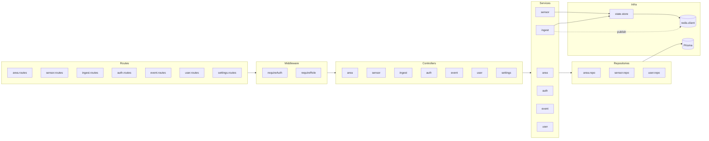

### Frontend structure

| Concern        | File(s)                                  | Notes |
|----------------|------------------------------------------|-------|
| Entry / routing| `App.jsx`, `main.jsx`                     | `BrowserRouter`, `ProtectedRoute` w/ role gating |
| Auth state     | `context/AuthContext.jsx`                | `useAuth()`; token+user in `sessionStorage` |
| API client     | `api/client.js`                          | `fetch` wrapper, auto-attaches Bearer token |
| Realtime       | `hooks/useWebSocket.js`                  | Auto-reconnect w/ exponential backoff; returns `sensorStates` |
| Shell          | `components/AppLayout.jsx`               | Collapsible sidebar, role-filtered nav, user menu |
| Pages          | `pages/*.jsx`                            | Dashboard, Sensors, Logs, Analytics, Manage, Settings, Login |
| UI primitives  | `components/*` (Button, Card, TextInput, etc.) | Shared design-system widgets |
| Styles         | `styles/shared.js`, CSS files           | `colors` tokens, shared style objects |

### Frontend routes & access

| Route        | Page          | Min role | Notes                                    |
|--------------|---------------|----------|------------------------------------------|
| `/login`     | LoginPage     | public   | Redirects to `/dashboard` if logged in   |
| `/dashboard` | DashboardPage | any auth | Map viewer + live status (read for VIEWER, edit for MANAGER+) |
| `/analytics` | AnalyticsPage | MANAGER  | Charts/stats                             |
| `/sensors`   | SensorsPage   | MANAGER  | Sensor registry CRUD                     |
| `/logs`      | LogsPage      | MANAGER  | Event log table                          |
| `/manage`    | ManagePage    | ADMIN    | User management                          |
| `/settings`  | SettingsPage  | any auth | Profile + preferences                    |

---

## 6. "OOP classes" — what actually exists

There are **no domain OOP classes** in this codebase. The architecture is deliberately
**functional + modular**: each layer exports plain functions over `module.exports`, and
state is passed as arguments rather than held on objects. This is a common and valid Node
style — worth calling out explicitly so nobody goes hunting for class hierarchies.

The only classes are **framework-provided / instantiated**, not authored domain types:

| Class               | Source            | Used as                                            |
|---------------------|-------------------|----------------------------------------------------|
| `PrismaClient`      | `@prisma/client`  | One instance per repository (DB gateway)           |
| `Redis` (ioredis)   | `ioredis`         | Two instances: `publisher` (commands) + `subscriber` (SUBSCRIBE mode) |
| `WebSocketServer`   | `ws`              | One `wss` instance in `ws/server.js`               |
| `express.Router`    | `express`         | One router per route module                        |

The closest things to "domain objects" are the **Prisma models** (§4) — they're the schema
types, not behavior-bearing classes. The "structures" that matter are the Redis state record
shape and the WebSocket message envelopes (§3.9).

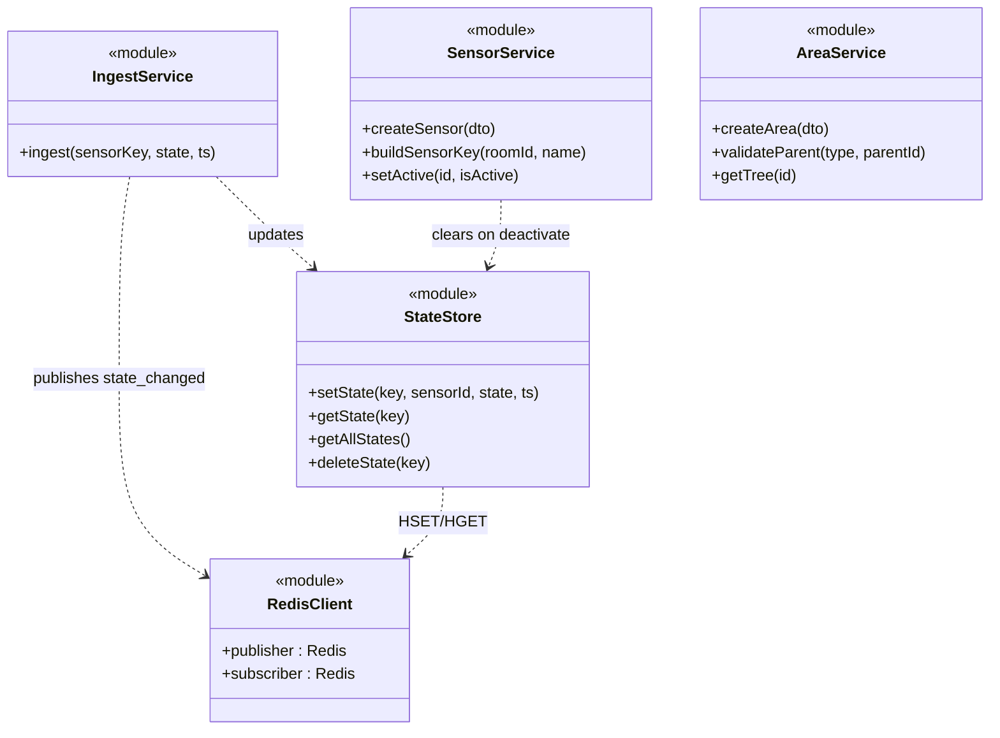

---

## 7. Sequence diagrams

### 7.1 Login & authenticated request

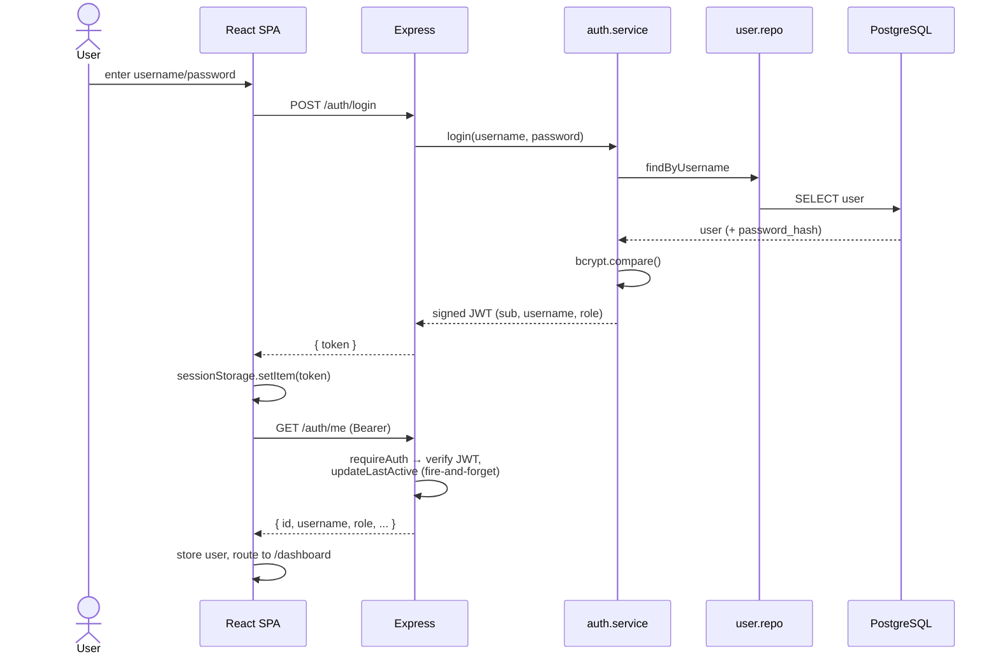

### 7.2 Sensor ingestion → persistence → live UI (the core pipeline)

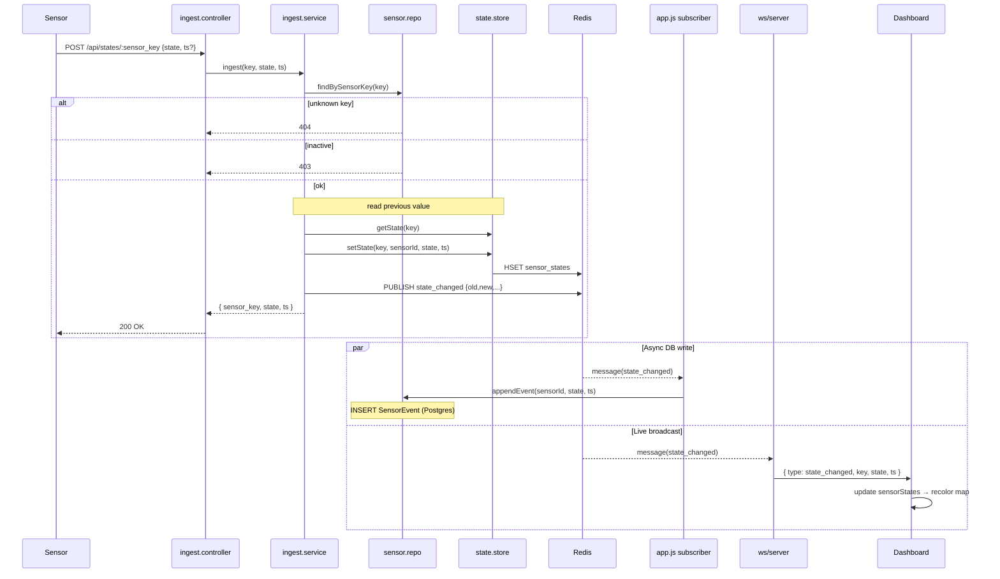

**Why two subscribers?** `app.js` subscribes to persist history (write to `SensorEvent`);
`ws/server.js` subscribes to broadcast to browsers. Both react to the same Redis
`state_changed` message — decoupling persistence from realtime delivery. The HTTP push
returns immediately after the Redis publish; DB write and fan-out happen asynchronously.

### 7.3 Sensor creation with auto-generated key

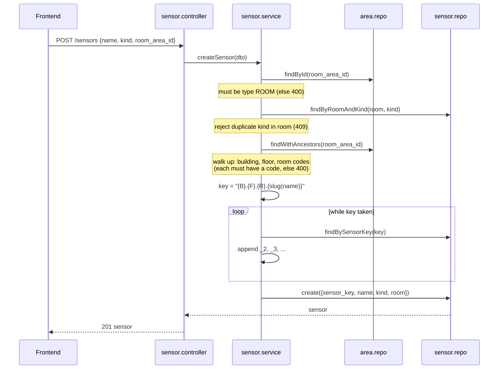

### 7.4 WebSocket lifecycle

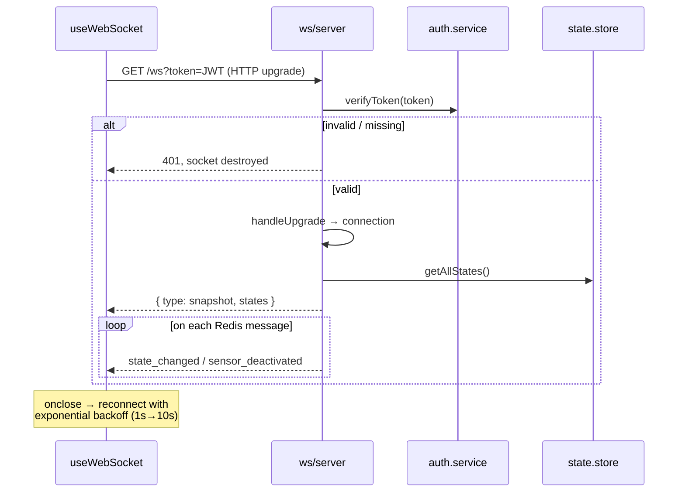

---

## 8. Workflow diagrams

### 8.1 Area hierarchy & creation rules

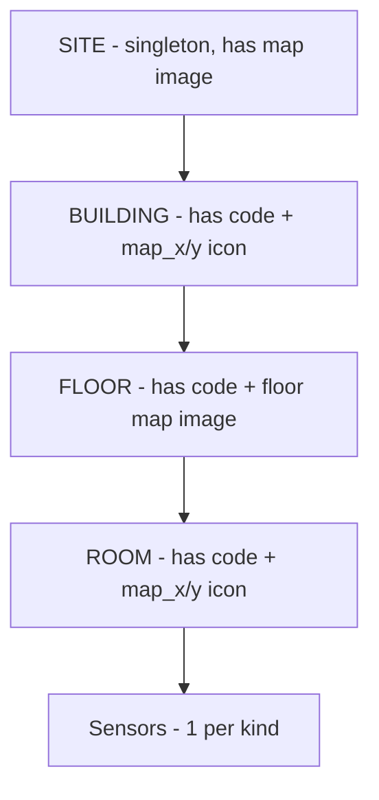

Creation validation (`area.service.validateParent`):

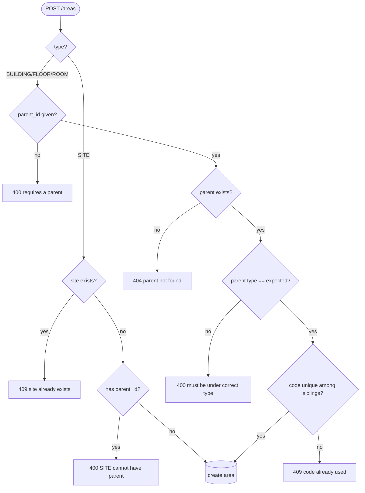

### 8.2 Sensor state classification → map color

The dashboard derives a status from the raw string value (`DashboardPage.classifySensorState`):

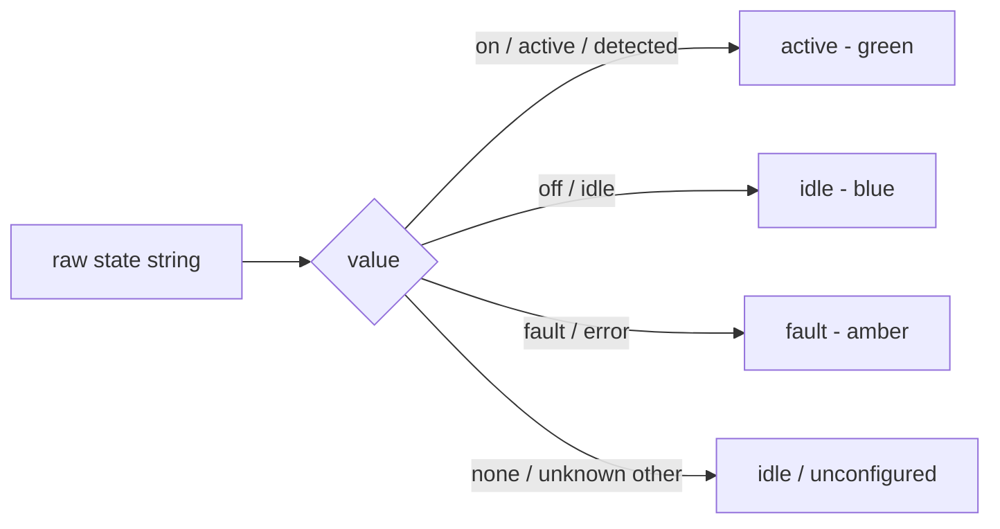

**Room color = worst-of aggregation** across its sensors: `fault` > `active` > `idle` >
`unconfigured`. A room with no sensors renders as `unconfigured` (grey).

### 8.3 Role-based access (RBAC)

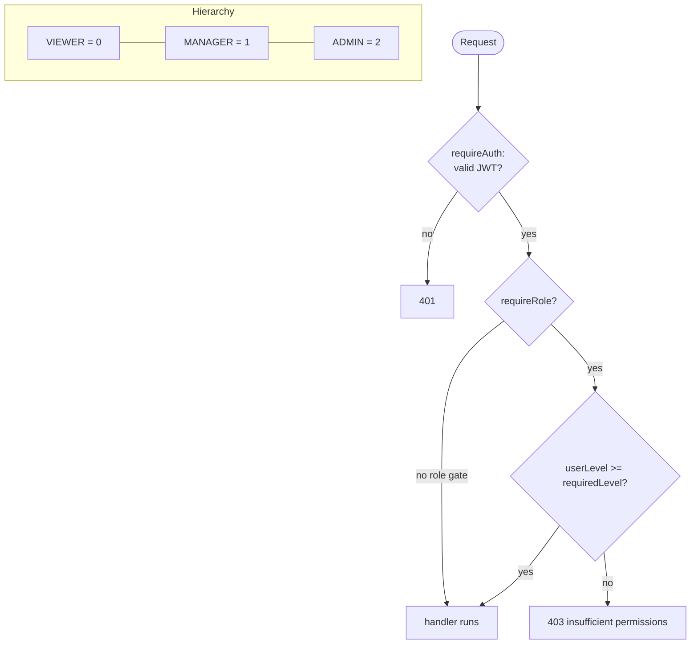

The same hierarchy is mirrored on the frontend (`ProtectedRoute` in `App.jsx`,
`AppLayout` nav filtering) — but it is **enforced** server-side by `requireRole`.

### 8.4 Sensor deactivation side-effects

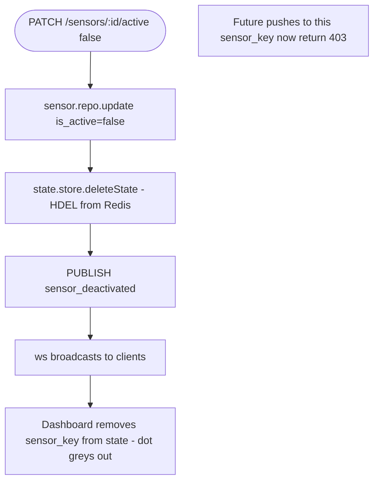

---

## 9. End-to-end data flow summary

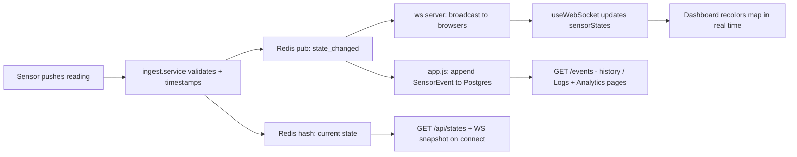

---

## 10. Glossary

| Term            | Meaning                                                                 |
|-----------------|------------------------------------------------------------------------|
| `sensor_key`    | Stable dotted ID `building.floor.room.name_slug` (e.g. `b01.f02.r103.motion_1`); how sensors address pushes |
| Current state   | Latest value per sensor, kept in Redis hash `sensor_states` (not in Postgres) |
| Event           | Immutable historical record of one state change (`SensorEvent` table)   |
| SITE            | Single root area holding the campus map image                           |
| `map_x`/`map_y` | Icon coordinates in *natural image* pixels; scaled to canvas at render  |
| Snapshot        | Full current-state map sent to a client right after WS connect          |
| `preferences`   | Per-user JSON blob for UI settings                                       |
```
