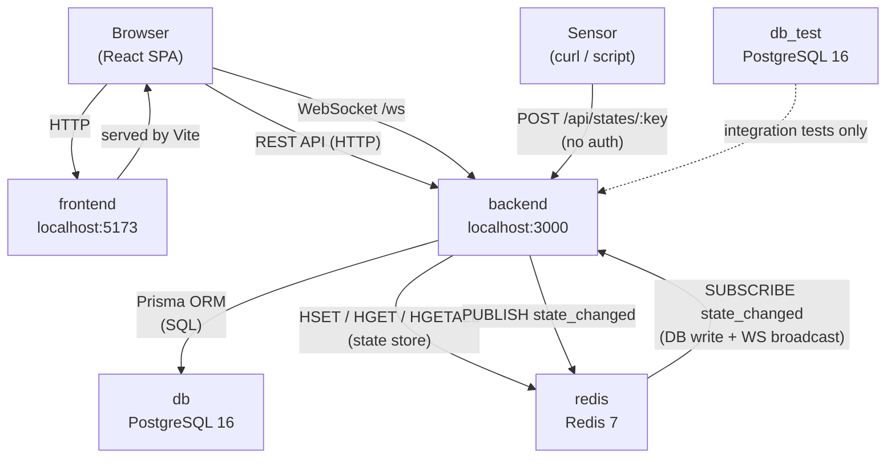

# ARDS Runbook

## Services



| Service   | Image / Build     | Port  | Purpose |
|-----------|-------------------|-------|---------|
| `db`      | postgres:16-alpine | —    | Primary PostgreSQL database for all application data |
| `redis`   | redis:7-alpine     | —    | Sensor state store (Redis hash) and Pub/Sub event bus |
| `backend` | ./backend          | 3000 | Node.js/Express API — ingestion, REST endpoints, WebSocket server |
| `frontend` | ./frontend        | 5173 | React SPA — map dashboard, sensor registry, event log |
| `db_test` | postgres:16-alpine | 5434 | Isolated PostgreSQL database used exclusively for integration tests |

### `db`
Runs PostgreSQL 16. Stores all persistent relational data: users, area hierarchy, sensors, and the append-only sensor event log (`SensorEvent`). Data is persisted in the `postgres_data` named volume so it survives container restarts. Has a healthcheck that `backend` waits on before starting.

### `redis`
Runs Redis 7 with AOF persistence (`--appendonly yes`), meaning sensor state survives restarts. Serves two roles:
- **State store** — current sensor readings held in a Redis hash (`sensor_states`)
- **Pub/Sub bus** — `state_changed` channel fans out ingestion events to the DB writer and WebSocket broadcaster

### `backend`
Built from `./backend/Dockerfile`. Runs the Express server on port 3000. Responsible for:
- REST API (auth, areas, sensors, ingestion, events)
- WebSocket server (`/ws`) for real-time state push to frontend clients
- Prisma ORM — runs `migrate deploy` on startup
- Depends on both `db` and `redis` being healthy before starting
- Map upload files stored in the `uploads_data` volume at `/app/uploads`

### `frontend`
Built from `./frontend/Dockerfile`. Runs the Vite dev server on port 5173. Connects to the backend via `VITE_API_URL` (defaults to `http://localhost:3000`). No persistent state — fully stateless.

### `db_test`
Separate PostgreSQL 16 instance used only for running the Jest integration test suite. Exposed on host port `5434` so tests can be run from the host machine. Keeps test data isolated from the production database. `TEST_DATABASE_URL` in `.env` points here.

---

## Docker Compose

### Start everything (build images if needed)
```bash
docker compose up --build
```

### Start in detached mode
```bash
docker compose up -d --build
```

### Stop all services
```bash
docker compose down
```

### Stop and wipe the database volume (full reset)
```bash
docker compose down -v
```

### Rebuild a single service
```bash
docker compose up --build backend
docker compose up --build frontend
```

### View logs
```bash
# All services
docker compose logs -f

# Single service
docker compose logs -f backend
docker compose logs -f frontend
docker compose logs -f db
```

### Restart a single service (without rebuild)
```bash
docker compose restart backend
```

---

## Database

### Open a psql shell inside the db container
```bash
docker compose exec db psql -U ards -d ards_db
```

### Run Prisma migrations manually (inside backend container)
```bash
docker compose exec backend npx prisma migrate deploy
```

### Re-run the seed script manually
```bash
docker compose exec backend node prisma/seed.js
```

### Open Prisma Studio (DB GUI) — runs on port 5555
```bash
docker compose exec backend npx prisma studio
```

---

## Auth — curl examples

### Login
```bash
curl -s -X POST http://localhost:3000/auth/login \
  -H "Content-Type: application/json" \
  -d '{"username":"admin","password":"admin123"}' | jq
```

### Get current user (replace TOKEN)
```bash
curl -s http://localhost:3000/auth/me \
  -H "Authorization: Bearer TOKEN" | jq
```

### Health check
```bash
curl -s http://localhost:3000/health | jq
```

---

## Areas — curl examples

All area endpoints require a Bearer token. Set it first:
```bash
TOKEN=$(curl -s -X POST http://localhost:3000/auth/login \
  -H "Content-Type: application/json" \
  -d '{"username":"admin","password":"admin123"}' | jq -r '.token')
```

### List root areas (buildings)
```bash
curl -s http://localhost:3000/areas \
  -H "Authorization: Bearer $TOKEN" | jq
```

### Create a building
```bash
curl -s -X POST http://localhost:3000/areas \
  -H "Authorization: Bearer $TOKEN" \
  -H "Content-Type: application/json" \
  -d '{"name":"Building A","type":"BUILDING"}' | jq
```

### Create a floor under a building (replace BUILDING_ID)
```bash
curl -s -X POST http://localhost:3000/areas \
  -H "Authorization: Bearer $TOKEN" \
  -H "Content-Type: application/json" \
  -d '{"name":"Floor 1","type":"FLOOR","parent_id":"BUILDING_ID"}' | jq
```

### Create a room under a floor (replace FLOOR_ID)
```bash
curl -s -X POST http://localhost:3000/areas \
  -H "Authorization: Bearer $TOKEN" \
  -H "Content-Type: application/json" \
  -d '{"name":"Room 101","type":"ROOM","parent_id":"FLOOR_ID"}' | jq
```

### Get children of an area
```bash
curl -s http://localhost:3000/areas/AREA_ID/children \
  -H "Authorization: Bearer $TOKEN" | jq
```

### Get full subtree from an area
```bash
curl -s http://localhost:3000/areas/AREA_ID/tree \
  -H "Authorization: Bearer $TOKEN" | jq
```

### Update an area
```bash
curl -s -X PUT http://localhost:3000/areas/AREA_ID \
  -H "Authorization: Bearer $TOKEN" \
  -H "Content-Type: application/json" \
  -d '{"name":"New Name","description":"Updated description"}' | jq
```

### Toggle active status
```bash
curl -s -X PATCH http://localhost:3000/areas/AREA_ID/active \
  -H "Authorization: Bearer $TOKEN" \
  -H "Content-Type: application/json" \
  -d '{"is_active":false}' | jq
```

### Delete an area (blocked if it has children)
```bash
curl -s -X DELETE http://localhost:3000/areas/AREA_ID \
  -H "Authorization: Bearer $TOKEN"
```

---

## Sensors — curl examples

```bash
TOKEN=$(curl -s -X POST http://localhost:3000/auth/login \
  -H "Content-Type: application/json" \
  -d '{"username":"admin","password":"admin123"}' | jq -r '.token')
```

### Register a sensor
```bash
curl -s -X POST http://localhost:3000/sensors \
  -H "Authorization: Bearer $TOKEN" \
  -H "Content-Type: application/json" \
  -d '{"sensor_key":"B01.F01.R101.motion1","name":"Motion Sensor 1","kind":"MOTION","room_area_id":"ROOM_ID"}' | jq
```

### List all sensors
```bash
curl -s http://localhost:3000/sensors \
  -H "Authorization: Bearer $TOKEN" | jq
```

### Toggle active status
```bash
curl -s -X PATCH http://localhost:3000/sensors/SENSOR_ID/active \
  -H "Authorization: Bearer $TOKEN" \
  -H "Content-Type: application/json" \
  -d '{"is_active":false}' | jq
```

### Delete a sensor
```bash
curl -s -X DELETE http://localhost:3000/sensors/SENSOR_ID \
  -H "Authorization: Bearer $TOKEN"
```

---

## Ingestion — curl examples

### Push a state update (no auth required)
```bash
curl -s -X POST http://localhost:3000/api/states/B01.F01.R101.motion1 \
  -H "Content-Type: application/json" \
  -d '{"state":"on"}' | jq
```

### Push with explicit timestamp (Unix seconds)
```bash
curl -s -X POST http://localhost:3000/api/states/B01.F01.R101.motion1 \
  -H "Content-Type: application/json" \
  -d '{"state":"off","ts":1700000000}' | jq
```

### Get current in-memory state snapshot (all sensors)
```bash
curl -s http://localhost:3000/api/states \
  -H "Authorization: Bearer $TOKEN" | jq
```

### Get current state for one sensor
```bash
curl -s http://localhost:3000/api/states/B01.F01.R101.motion1 \
  -H "Authorization: Bearer $TOKEN" | jq
```

---

## Service URLs

| Service  | URL                        |
|----------|----------------------------|
| Frontend | http://localhost:5173       |
| Backend  | http://localhost:3000       |
| Health   | http://localhost:3000/health |

---

## Default Credentials

| Username | Password  | Role  |
|----------|-----------|-------|
| admin    | admin123  | ADMIN |
